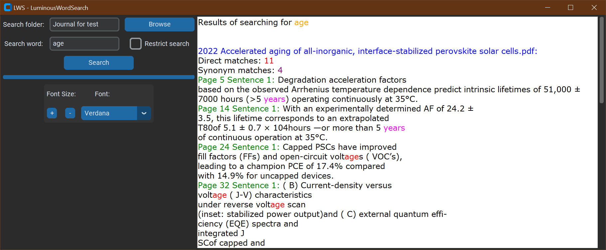

# LWS - LuminousWordSearch

This repository contains a Python script that searches for specific keywords in PDF and Word documents. The script utilizes several libraries, such as `PyPDF2`, `docx`, and `nltk`, and makes use of `ThreadPoolExecutor` from the `concurrent.futures` module for concurrent processing.

## Features

- Search for keywords in multiple PDF and Word documents concurrently
- Supports case-insensitive keyword matching
- Generates a summary of the search results, including the number of occurrences and document names
- Utilizes `ThreadPoolExecutor` for efficient concurrent processing
- Highlights found keywords in different colors
- Supports searching for synonyms
- Provides a "Restrict" button for more refined searches
 

## Usage

1. Download the latest executable from the [Releases](https://github.com/Rusya665/Artticles_parser/releases) section.
2. Install the program to your computer (Windows only). For all OS you also can utilize the source python code. NOTE: in this case explicitly download NLTK data (`nltk.download('wordnet')` and `nltk.download('punkt')`)  
3. Run the `PDF_docx_searcher.exe` file.
4. Follow the on-screen prompts to select the folder containing the PDF and Word documents, and enter the word you want to search for. NOTE: you can also provide a phrase by, for example, copy-pasting it. In this case you will be asked in pop-up window do you want to continue, but the program behaviour with phrases is unexpected. Also, there is not direct support of synonyms for phrases.
5. The results will be displayed with the found keywords highlighted in different colors. Red color represents a direct match, magenta - synonym.
6. Use the `Restrict search` button for only direct matches.

## Known Issues

Due to a known issue with `ProcessPoolExecutor` and the creation of multiple windows when running the compiled executable, this script uses `ThreadPoolExecutor` for concurrent processing. This allows the script to work correctly as a standalone executable without causing any unexpected behavior.

## Upcoming Features

1. Renaming of files: Making the file naming in the project to be consistent.
2. Improved search performance: Optimizations to enhance the search performance and provide faster results.
3. Customizable color-coding: The ability to customize the color-coding of keywords in the search results.
4. Advanced search options: Additional search parameters and filters to help users fine-tune their search queries and find the desired results more efficiently.

## Contributions

Feel free to submit pull requests, report issues, or suggest enhancements.

## License

This project is licensed under the [MIT License](https://opensource.org/licenses/MIT).
